# mco_optimizer
Jasleen Grewal  
2016-10-16  


## Genetic Algorithms
This is an R package that uses genetic algorithms for multi-objective, multi-parameter optimzation <https://cran.r-project.org/web/packages/mco/index.html>.


###Introduction  
Genetic Algorithms are a set of adaptive algorithms that have been applied in several optimization problems for the identification of Pareto Frontiers (a multi-metric optimal solution space for an evaluated function). GAs are also used in optimization problems because of their tractability for global optimization of multiple parameters simultaneously, in the presence of several local optimas.  

###Methods    
####Data  
The input data is an interleaved fastq file, total reads 200,000. Reference organism *Homo sapiens*   

####Tool  
We used the ABYSS tool (version 2.1.0) for assembly of contigs from input paired-end reads. For sake of evaluation, and being aware of the extensive computational and time costs of assembling an entire eukaryotic genome, we used a 500k subsampled set of reads (?? add more detail) as input for ABYSS.  
There are several optimizable parameters for an assembly tool such as ABYSS. For the purposes of this evaluation exercise, we chose the following setup:  

Testable Parameter | Output Metric 1 | Output Metric 2 | Input range  
k | N50 | L50 | 16-45 (step size 1)  
s | N50 | L50 | 200-1000 (step size 10)  
l | N50 | L50 | 16-50  

####Optimization Algorithm   
The Optimization algorithm chosen from among the set of genetic algorithms available for optimization was **Neighbourhood Sorting Genetic Algorithm II** (NSGA II). This algorithm is able to optimize for multiple parameters, considering several output metrics for optimization simultaneously. Initially proposed in 2002 by [K. Deb et al]("http://ieeexplore.ieee.org/document/996017/"),  

###Results   
<?? Table compiling results together, best parameter value across different optimization criteria>  

####Source data reading functions 
Let us load the fits of the various optimization functions

```
## [1] "/Users/jgrewal/mygits/2016_project_2/scripts/R_optimizers/mco"
```

####Get test parameter ranges

```r
library("rjson")
json_file <- paste(workdir, "scripts/R_optimizers/common/config.json", sep="/")
json_data <- fromJSON(paste(readLines(json_file), collapse=""))
params = json_data$variables
#By default, if there is an integer ranged parameter, we will initialize the genetic algorithm population to half the size of the range of this parameter
#If parameter is float, genetic algorithm population will be set by default to the range to the parameter
getpoprange <- function(x){ifelse(x$type=="INT",(round((x$max-x$min)/2) - (round((x$max-x$min)/2) %% 4)), ((x$max-x$min) - ((x$max-x$min) %% 4)))}
inparam=params$k
inparam1=params$k
inparam2=params$s
inparam3=params$l
```

Now let us visualize the optimization results (multi input, multi metric)
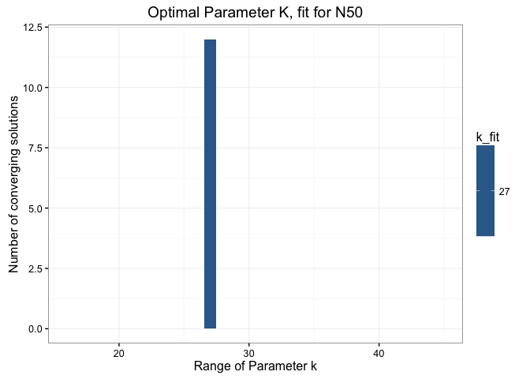<!-- -->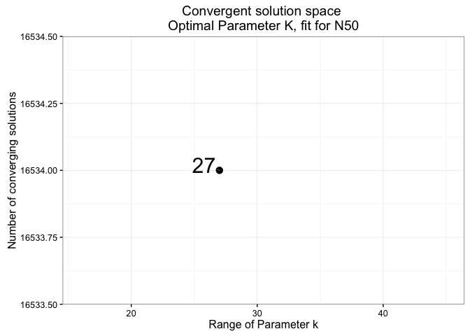<!-- -->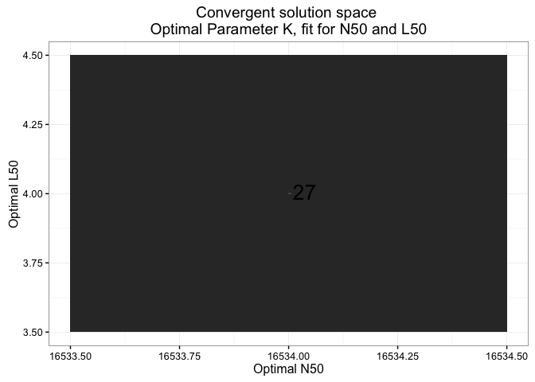<!-- -->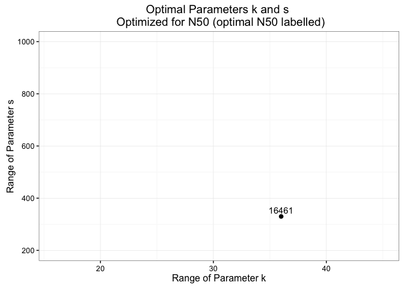<!-- -->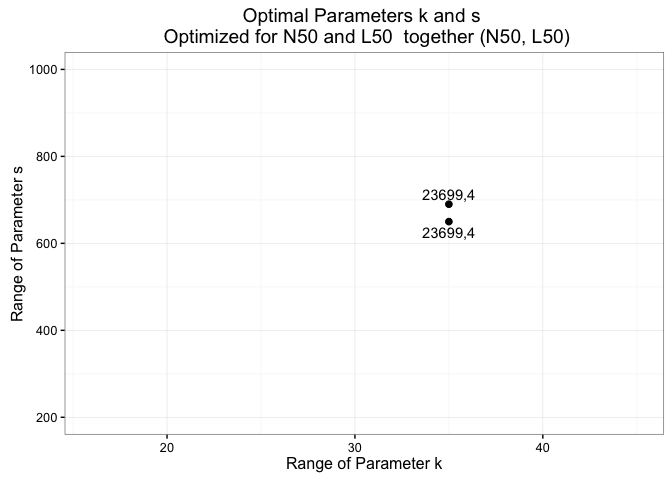<!-- -->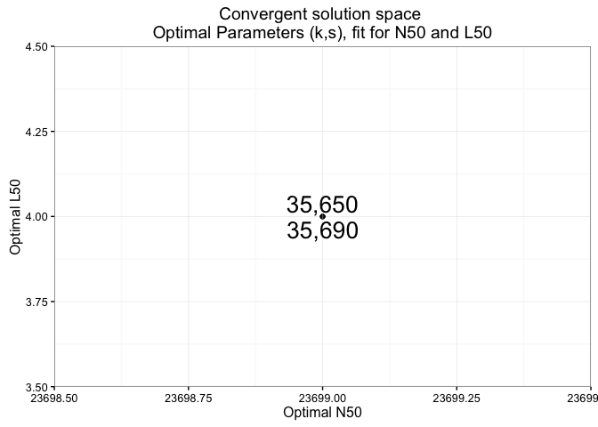<!-- -->

####Pareto Frontier Plots for various input metrics
Lastly, let us visualize the Pareto Frontier for N50 with L50
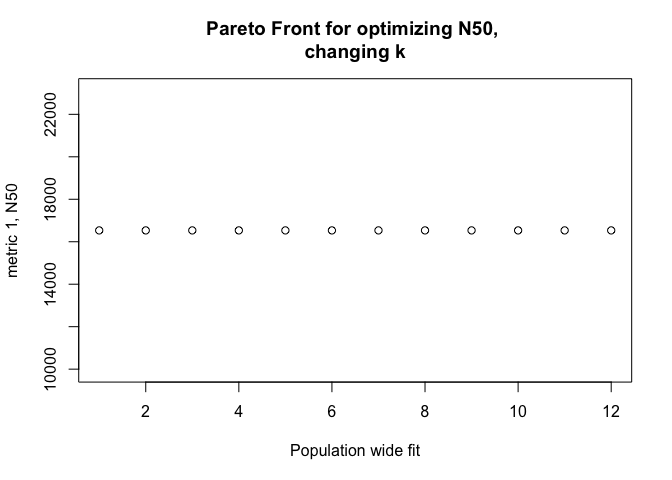<!-- -->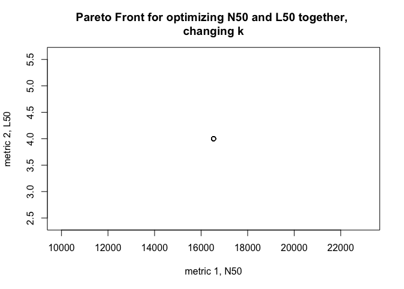<!-- -->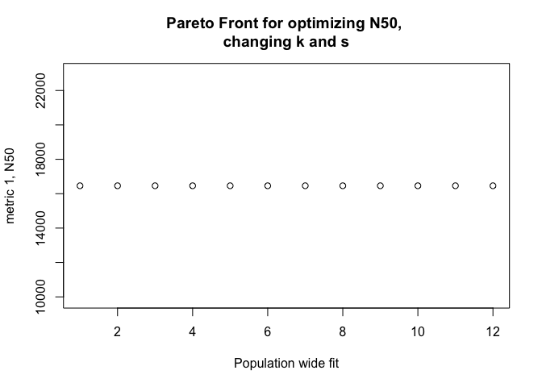<!-- -->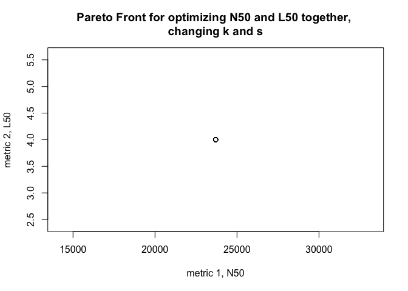<!-- -->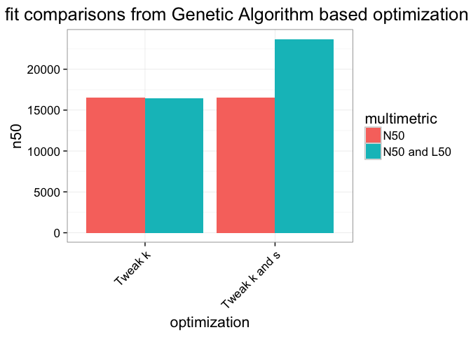<!-- -->

####Response variable vs Input parameter plot


###Discussion  

