# Optimizing abyss with optimx
Hamid Younesy  
October 16, 2016  

## Introduction

**["optimx"](https://cran.r-project.org/web/packages/optimx/index.html)** is a 
general-purpose optimization wrapper function that calls other R tools for
optimization.

### Usage

```r
optimx(par, # a vector of initial values for the parameters for which optimal values are to be found. 
       fn,  # A function to be minimized, with first argument the vector of parameters
       method=c("Nelder-Mead","BFGS"),  # list of the methods to be used (can be more than one)
       lower=-Inf, upper=Inf, # Bounds on the variables
       itnmax=NULL, # maximum number of iterations
       control=list(),
       ...)
```

Possible method codes are: 'Nelder-Mead', 'BFGS', 'CG', 'L-BFGS-B',
'nlm', 'nlminb', 'spg', 'ucminf', 'newuoa', 'bobyqa', 'nmkb', 'hjkb', 'Rcgmin', or 'Rvmmin'.

We have is a wrapper function testOptimx() around optimx to run optix for a given function and
plot the results.


```
## Warning: package 'ggplot2' was built under R version 3.2.4
```

## Testing with simple functions.

First, let's test some simple functions of the form f(x, y) = f1(x) + f2(y).
These will all be minimization and the optimum metric is 0.
To mimick discrete parameters we have currently opted for rounding things so that fir an int x, the optimizer queries between (x-. 5,x+.5] get passed as x to the function. since k parameter in abyss is still always int. 
Interestingly convergence did not happen for most algorithms in optimx's package if we were floor'ing parameters

### Two continious parameters: f(x1, x2) = abs(x1 - 5) + abs(x2 - 4)

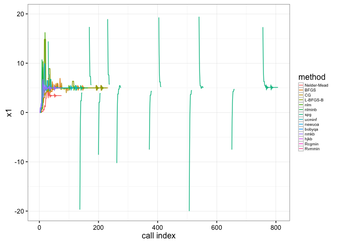<!-- -->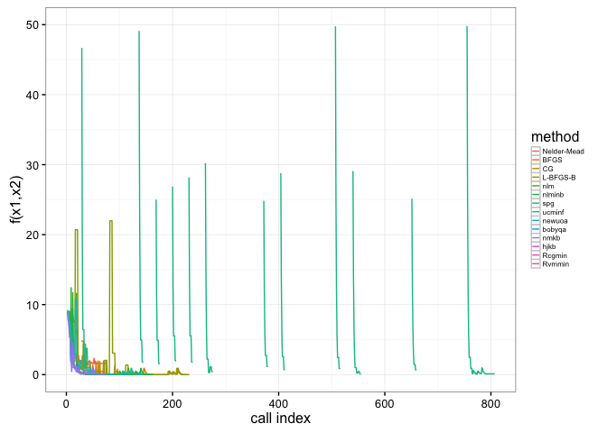<!-- -->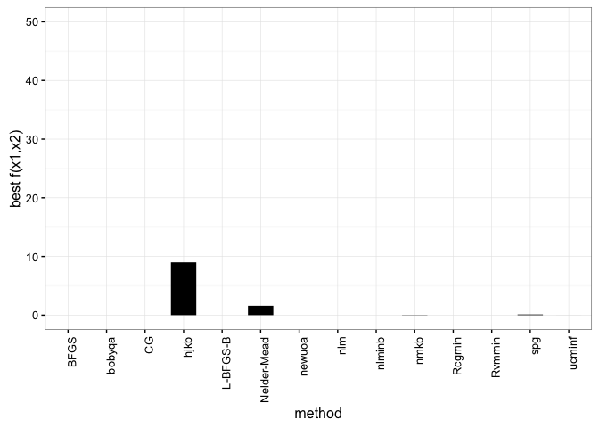<!-- -->

### One continious and one discrete parameter: f(x1, x2) = abs(x1 - 5) + abs(round(x2)-4)

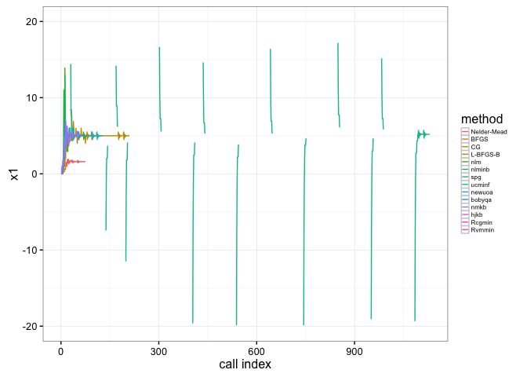<!-- -->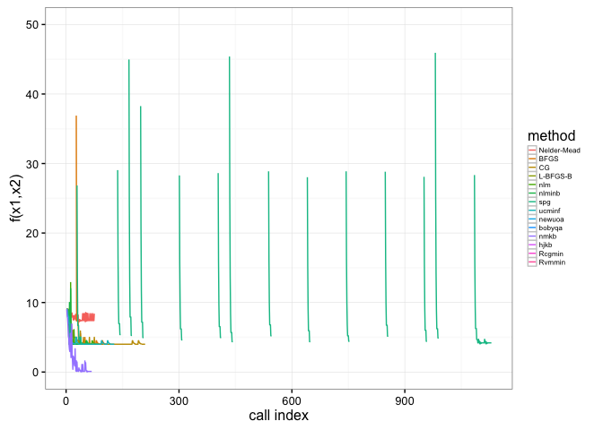<!-- -->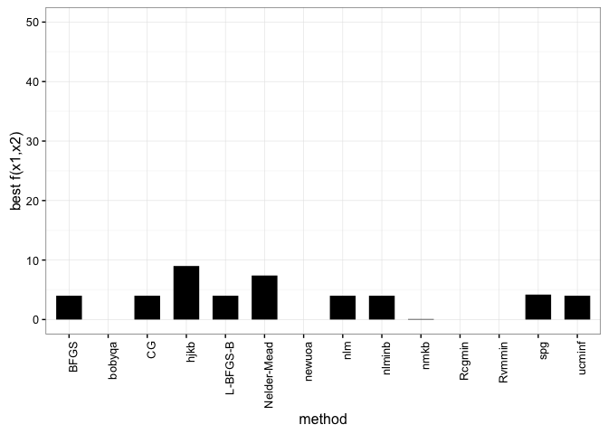<!-- -->

### Two discrete parameters: f(x1, x2) = abs(round(x1)-5) + abs(round(x2)-4)

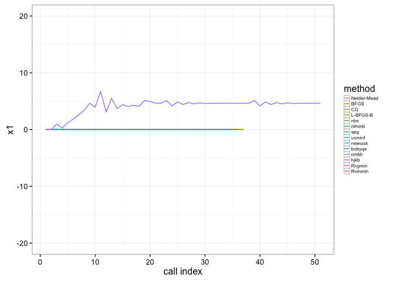<!-- -->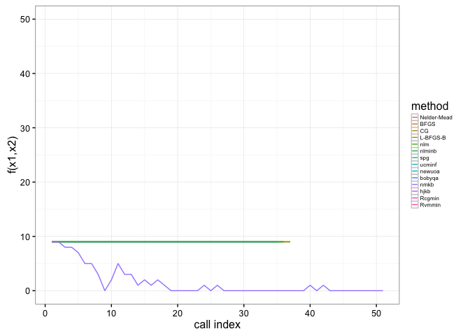<!-- -->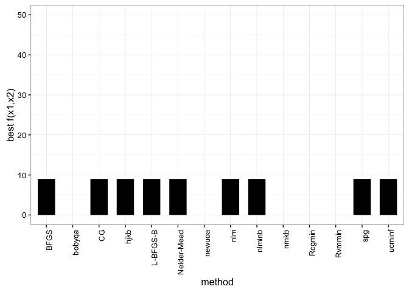<!-- -->

## Testing with abyss
Data: hsapien chr3, 500k reads

Varying paramter: k

Fixed parameters: s = 200, l = 25

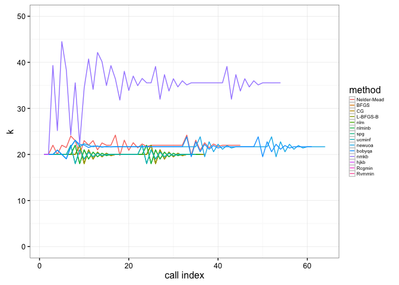<!-- -->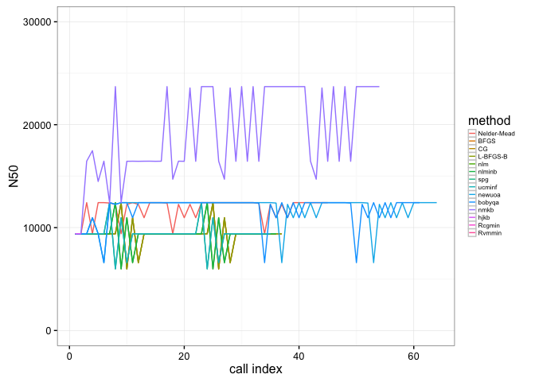<!-- -->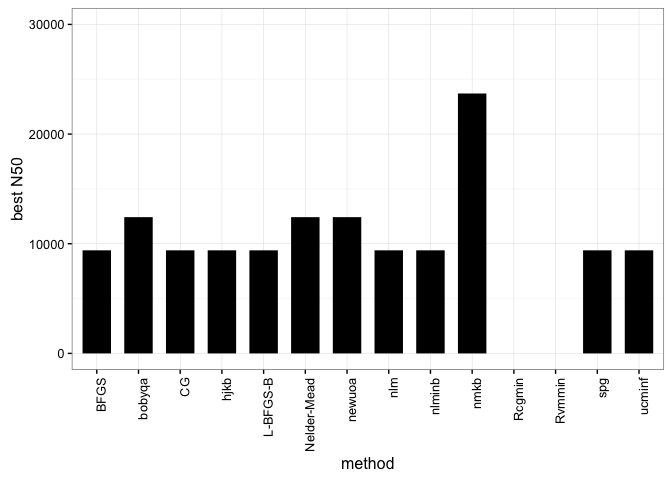<!-- -->


