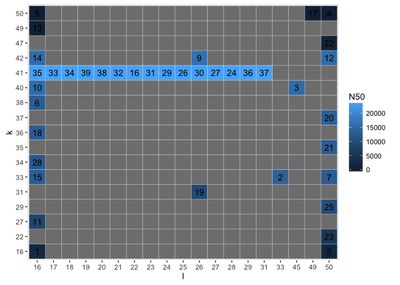

# Visualizing the optimization values
Veera  
17 October 2016  


# Load the data 


```r
dfm = read.table("iterations.tsv", sep = "\t", header = TRUE)
```

# Load the libraries


```r
library(ggplot2)
library(reshape2)
```

#create a data matrix for heatmap


```r
dfm.matrix = acast(dfm, k ~ l, value.var = "N50")
```

# Melt the data frame for ggplot heatmap


```r
dfm.melt = melt(dfm.matrix)
#rename the columns
names(dfm.melt) = c("k","l","N50")

# change the k andl column classes to factor

dfm.melt$k = as.factor(dfm.melt$k)
dfm.melt$l = as.factor(dfm.melt$l)
dfm.melt = merge(dfm.melt,dfm, by = c("k","l","N50"), all.x= TRUE)
```


# plot the heatmap


```r
ggplot(dfm.melt, aes(l,k)) + geom_tile(aes(fill = N50), colour = "white") + geom_text(aes(label = Iteration))
```

```
## Warning: Removed 284 rows containing missing values (geom_text).
```

<!-- -->

```r
ggsave("heatmap.png")
```

```
## Saving 7 x 5 in image
```

```
## Warning: Removed 284 rows containing missing values (geom_text).
```


