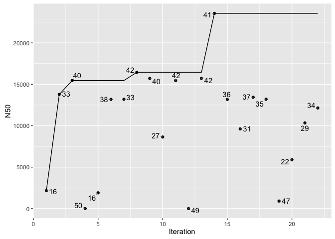
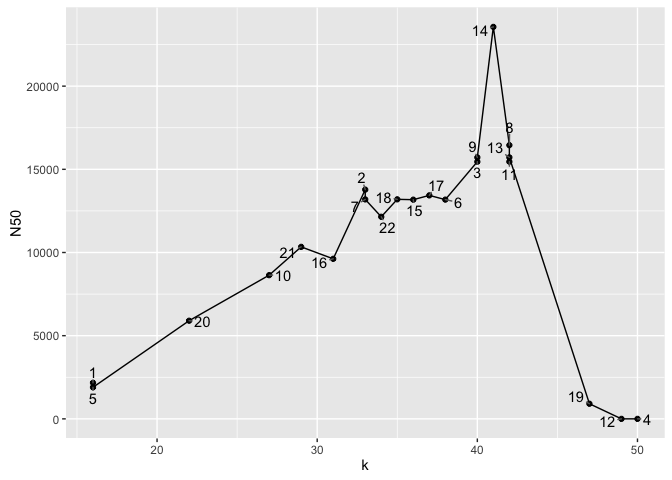
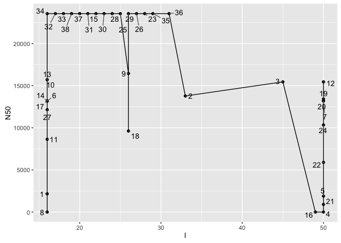

# Optimize genome sequence assembly parameters
Shaun Jackman  
2016-10-17  


```r
library(ggplot2)
library(ggrepel)
library(tidyverse)
```

# Read the data

```r
data_orig <- read_tsv("results/iterations.tsv")
data_k <- data_orig %>%
	select(k, N50) %>%
	distinct() %>%
	mutate(Best_N50 = cummax(N50), Iteration = row_number())
data_l <- data_orig %>%
	select(l, N50) %>%
	distinct() %>%
	mutate(Best_N50 = cummax(N50), Iteration = row_number())
```

# Best N50 vs Iteration

```r
ggplot(data_k) +
	aes(x = Iteration, y = N50, label = k) +
	geom_point() +
	geom_text_repel() +
	geom_line(aes(y = Best_N50))
```

<!-- -->

# N50 vs k

```r
ggplot(data_k) +
	aes(x = k, y = N50, label = Iteration) +
	geom_point() +
	geom_line() +
	geom_text_repel()
```

<!-- -->

# N50 vs l

```r
ggplot(data_l) +
	aes(x = l, y = N50, label = Iteration) +
	geom_point() +
	geom_line() +
	geom_text_repel()
```

<!-- -->
